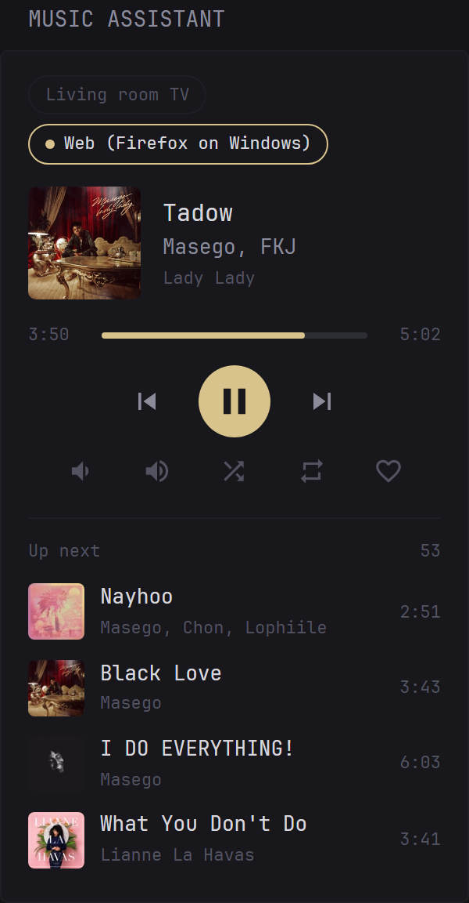

# Glance Music Assistant

A [Glance](https://github.com/glanceapp/glance) dashboard widget that shows and controls your
[Music Assistant](https://www.music-assistant.io) players. It talks to Music Assistant directly, so it
works without Home Assistant.



- Now playing with cover art, artist and album, one tab per player with a queue
- Play/pause, previous/next, seek by clicking the progress bar, volume, shuffle and repeat
- Up next list; click a track to play it
- Updates itself when a track ends, and only the widget re-renders after a command
- Read-only mode that keeps the token out of the page
- A single `custom-api` widget: no extra container or service

## Quick start

1. In Music Assistant create a user with the role **User**, a player filter for your dashboard players and a long-lived token for it (guests cannot have long-lived tokens).
2. Give Glance the environment variables `MA_URL` (for example `http://192.168.1.10:8095`) and `MA_TOKEN`.
3. Copy [`widget/music-assistant.yml`](widget/music-assistant.yml) next to your `glance.yml` and include it in a column:

   ```yaml
   widgets:
     - $include: music-assistant.yml
   ```

Options, the security note about the token and troubleshooting are in [`widget/README.md`](widget/README.md).

## Repository layout

```
widget/   the widget: music-assistant.yml, README in community-widgets format, meta.yml, previews
docs/     api-notes.md (verified Music Assistant and Glance details), example API responses
dev/      mock Music Assistant, local Glance config, browser tests
```

## Roadmap

- [x] Read-only view from the Music Assistant HTTP API
- [x] Controls over the Music Assistant WebSocket API, widget-only refresh
- [ ] Live updates from Music Assistant events: running time, drag to seek, volume slider, instant button state
- [ ] Optional favourite button (`library.write`, part of the User role)
- [ ] Submit to [glanceapp/community-widgets](https://github.com/glanceapp/community-widgets)

## Development

See [`dev/README.md`](dev/README.md). In short: `python3 dev/test_e2e.py` runs a mock Music Assistant and
Glance and clicks through every control in Chromium.

## License

[MIT](LICENSE)
